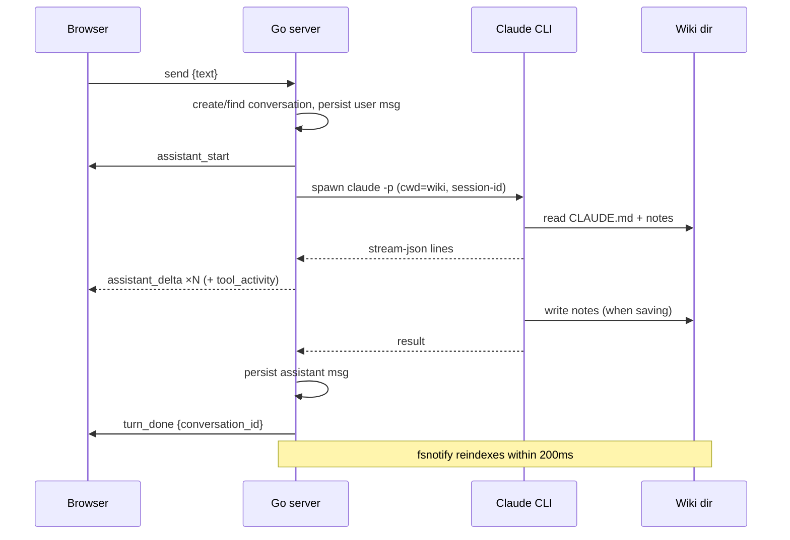

# API

The server exposes REST for everything except the live chat, which is a WebSocket. All routes are registered in `internal/api/server.go`.

## REST endpoints

| Method + Path | Request | Response |
|---|---|---|
| `GET /api/health` | — | `{status, claude:{found,path}, wiki:{path,exists}}` |
| `GET /api/search?q=&limit=` | q required; limit default 20, clamped 1–100 | `{results:[{path,title,kind,snippet}]}` — snippet is HTML-escaped with safe `<mark>` highlights |
| `GET /api/notes?path=` | wiki-relative path | `{path, content}` |
| `GET /api/wiki/tree` | — | `{nodes:[{name,path,is_dir,children}]}` |
| `GET /api/settings` | — | full config object |
| `PUT /api/settings` | full config object | saved config; validates `wiki_path`/`host` non-empty, port 1–65535 |
| `GET /api/conversations` | — | `{conversations:[{id,title,created_at}]}` |
| `POST /api/conversations` | `{title}` | `{id,title}` |
| `GET /api/conversations/:id` | — | `{conversation, messages:[…]}` |

**Errors:** JSON `{"error":"<msg>"}` — 400 for client errors, 404 not found, 500 always the generic `{"error":"internal error"}` (details go to the server log only).

## WebSocket chat (`/ws`)

One socket per browser tab. The protocol is small and typed on both sides (`internal/api/chat.go` ↔ `web/src/ws/chat.ts`):

| Direction | Frames |
|---|---|
| client → server | `{"type":"send","text":…}` · `{"type":"cancel"}` · `{"type":"resume","conversation_id":…}` |
| server → client | `assistant_start` · `assistant_delta {text}` · `tool_activity {tool, detail}` · `turn_done {conversation_id}` · `error {message}` |

**Semantics:**

- **Supersede** — a new `send` while a turn runs cancels the in-flight turn and starts the next
- **Cancel** — kills the CLI process group; the UI receives `error {message:"cancelled"}` and nothing is persisted for that turn
- **Resume** — after a reconnect, the client sends `resume`; the server replays the last turn's frames (≤ 500-message ring), then continues live
- **Titles** — derived from the first message, truncated at 60 runes
- **Origins** — only localhost origins are accepted on the upgrade (see [Security](security.md))
