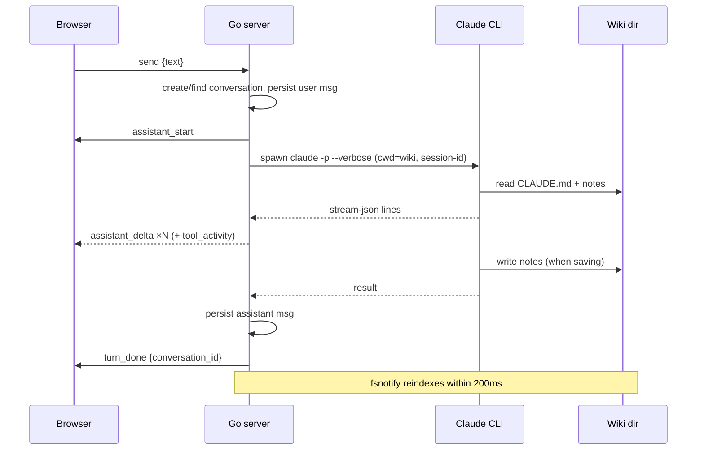

# API

The server exposes REST for everything except the live chat, which is a WebSocket. All routes are registered in `internal/api/server.go`.

## REST endpoints

| Method + Path | Request | Response |
|---|---|---|
| `GET /api/health` | — | `{status, claude:{found,path}, wiki:{path,exists}}` |
| `GET /api/search?q=&limit=` | q required; limit default 20, clamped 1–100 | `{results:[{path,title,kind,snippet}]}` — snippet is HTML-escaped with safe `<mark>` highlights |
| `GET /api/notes?path=` | wiki-relative path | `{path, content}` |
| `GET /api/wiki/tree` | — | `{nodes:[{name,path,is_dir,children}]}` |
| `GET /api/doctor` | — | `{checks:[{name, ok, message}]}` — the shared `internal/doctor` suite (same checks as `thoth doctor`) |
| `GET /api/settings` | — | `{wiki_path, repo_url, sync_enabled}` — every value lives in the `settings` key/value table in thoth.db (config.toml is deprecated) |
| `PUT /api/settings` | `{wiki_path, repo_url, sync_enabled}` | saved values (KV upserts; the wiki-path-change callback runs first); 400 when `wiki_path` is empty |
| `POST /api/github/auth` | `{token}` | identity `{username, display_name, email, avatar_url, scopes}` — the token itself is never returned; 400 "token is required" / "github rejected the token" |
| `GET /api/github/auth` | — | identity (all fields empty when not connected) |
| `DELETE /api/github/auth` | — | `{ok:true}` (idempotent) |
| `GET /api/github/repos` | — | `{repos:[{full_name, clone_url}]}` — the connected account's repos (fetched with the stored token; empty when not connected; 400 "github rejected the token" when revoked) |
| `GET /api/conversations` | — | `{conversations:[{id,title,created_at}]}` |
| `POST /api/conversations` | `{title}` | `{id,title}` |
| `GET /api/conversations/:id` | — | `{conversation, messages:[…]}` |
| `POST /api/git/setup` | `{url}` | `{ok:true}` or `{ok:false, error}` — inits a repo in the wiki dir if needed, points `origin` at `url`, commits the tree, and pushes `HEAD`; each git command has a 15 s timeout, errors are sanitized (never echo credentials/URLs) |

**Errors:** JSON `{"error":"<msg>"}` — 400 for client errors, 404 not found, 500 always the generic `{"error":"internal error"}` (details go to the server log only).

**SPA deep links:** `/chat/<conversation-id>` serves the app shell (index.html fallback in `internal/webui`), which loads and pins that conversation; unknown `/api/*` paths stay JSON 404s.

## WebSocket chat (`/ws`)

One socket per browser tab. The protocol is small and typed on both sides (`internal/api/chat.go` ↔ `web/src/ws/chat.ts`):

| Direction | Frames |
|---|---|
| client → server | `{"type":"send","text":…}` · `{"type":"cancel"}` · `{"type":"resume","conversation_id":…}` · `{"type":"open","conversation_id":…}` · `{"type":"new_chat"}` |
| server → client | `assistant_start` · `assistant_thinking {text}` · `assistant_delta {text}` · `tool_activity {tool, detail}` · `turn_done {conversation_id}` · `error {message}` |

**Semantics:**

- **Supersede** — a new `send` while a turn runs cancels the in-flight turn and starts the next
- **Cancel** — kills the CLI process group; the UI receives `error {message:"cancelled"}` and nothing is persisted for that turn
- **Resume** — after a reconnect, the client sends `resume`; the server replays the last turn's frames (≤ 500-message ring), then continues live
- **Open** — pins the connection to an existing conversation so the next `send` continues it (conversation-history load). No replay, no other effect; an unknown id gets `error {message:"unknown conversation"}` and the connection stays unpinned
- **New chat** — unpins the connection (cancels an in-flight turn first, which emits `error {message:"cancelled"}`); the next `send` starts a fresh conversation
- **Sessions** — every conversation stores its Claude CLI session id (`conversations.claude_session_id`, seeded as the conversation id, migration 0003 backfills legacy rows). A turn reusing a session id the CLI reports as "already in use" (stale lock from a cancelled turn) forks once into a fresh id via `--resume <old> --fork-session` and persists the fork
- **Titles** — derived from the first message, truncated at 60 runes
- **Origins** — only localhost origins are accepted on the upgrade (see [Security](security.md))
