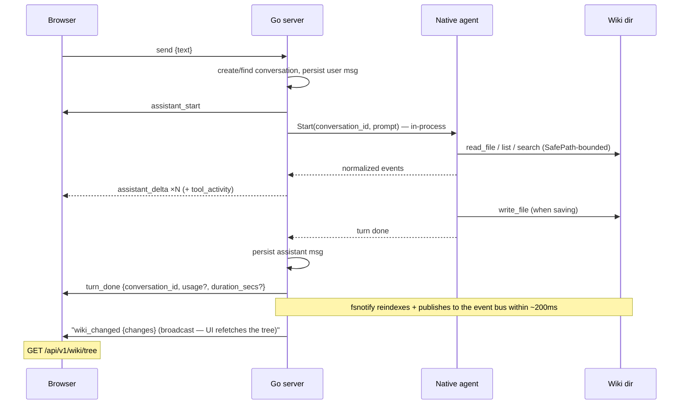

# API

Thoth exposes a **REST API** for everything except the live chat and server-push notifications (`wiki_changed`), which run over a **WebSocket**.

## REST API

The REST surface is documented as an OpenAPI 3.x specification — the single source of truth for paths, schemas, parameters, status codes, and the `{"error": "<message>"}` error envelope.

- **Live spec** — served by a dev server at [`/swagger.json`](http://127.0.0.1:8334/swagger.json)
- **Interactive reference** — browse every endpoint with a request runner at [`/api/docs`](http://127.0.0.1:8334/api/docs)
- The spec is embedded in the server binary, so it can never drift from the handlers

> **Note:** both endpoints exist only under `thoth serve --dev` (excluded by `--no-api-docs`); they are never exposed in normal serve.

### Versioning

- Every REST route lives under `/api/v1/...`
- The chat WebSocket upgrades at `/ws/v1`
- The unversioned paths do not exist — the move was hard, since the embedded frontend ships in the same binary
- A future breaking change bumps the segment (`/api/v2/...`) rather than mutating v1 in place

### Operations

| Topic | Detail |
|---|---|
| Logging | Every `/api/v1/*` request is logged at Info level with method, path, status, and duration — the source of truth for latency investigations. Errors carry the error text; SPA assets and `/ws/v1` are not logged. |
| SPA deep links | `/chat/<conversation-id>` serves the app shell (index.html fallback), which loads and pins that conversation; unknown `/api/v1/*` paths stay JSON 404s. |
| Note promotion | `POST /api/v1/notes` files a chat answer (or any markdown) into the wiki as a permanent note via the same save path the assistant's own saves use (`wiki.Save`): frontmatter with `title`/`date`/`type` matching the folder, kebab-case filename, validated through `wiki.Validate`. The folder defaults to the first configured one; the title defaults to the content's first heading/line. The saved note is searchable immediately and appears in the tree within the watcher's ~200 ms debounce. |
| Wiki export | `GET /api/v1/wiki/export` streams a zip of the wiki tree — folders, notes, attachments, and the `CLAUDE.md` rulebook — for backup or transfer. The zip is streamed (never fully buffered); dotfiles are skipped by default except `.gitkeep` (which preserves empty scaffold folders), and `?history=1` includes them so git history can travel. 404 when the wiki root does not exist. |
| Wiki import | `POST /api/v1/wiki/import` (multipart `file`) validates a wiki zip and **backup-first merges** it onto the wiki root: the existing tree is copied to a sibling `<root>-backup-<timestamp>` first, then the archive's files are laid over it (archive wins on conflicts, local-only files are kept), and the index is rebuilt so search and the tree reflect the import. Every entry is path-traversal-checked; the archive must be wiki-shaped (a root `CLAUDE.md` or a markdown note with frontmatter). Limits: request body ≤ 200 MiB (413), single entry ≤ 100 MiB, total extracted ≤ 500 MiB (400). |
| Sync restore | `POST /api/v1/sync/connections/:id/restore` downloads a stored archive (the latest snapshot, or a chosen key) and imports it onto the wiki via the same backup-first merge as the upload path, then reindexes and pushes a `wiki_changed` frame. `GET /api/v1/sync/connections/:id/snapshots` lists the restore points (S3 objects / local backup files, newest-first). Git-kind connections are push-only and return 400 ("restore is not supported for this destination"). |
| Sync push | `POST /api/v1/sync/connections/:id/push` syncs the wiki through the connection's driver. Transient failures (network flakes, server faults) are retried with exponential backoff; a retried-then-failed error is annotated "(retried N times)" in `last_error`. Every outcome records `last_synced_at`/`last_error` and appends to the connection's `push_history` (capped at 20), which the connection DTO carries. |
| Auto-sync | A background scheduler (started in `serve`) pushes enabled connections whose `interval` config field (minutes) has elapsed since their last sync attempt (success or failure), so a failing connection cools down between retries; a connection already in flight is skipped. Each result is broadcast to connected clients as a `sync_result` WS frame, which the UI surfaces as a notification. |

## WebSocket chat (`/ws/v1`)

The chat runs over a single WebSocket per browser tab. The protocol is small and typed on both sides — the server frame types and the client `ChatSocket` share a schema, with frame names centralized in one constants module.

> **Note:** the WS frames are unchanged from the old CLI-driven design — the supersede/cancel semantics and resume replay are identical; only what happens server-side behind the frames changed (an in-process agent turn instead of a spawned CLI process). The additions are an optional `usage` object and an optional `duration_secs` on `turn_done` (token + latency telemetry) — both `omitempty` and ignored by older clients, so the protocol stays backward compatible.

### Frames

| Direction | Frames |
|---|---|
| client → server | `{"type":"send","text":…}` · `{"type":"cancel"}` · `{"type":"resume","conversation_id":…}` · `{"type":"open","conversation_id":…}` · `{"type":"new_chat"}` · `{"type":"presence","active":bool}` |
| server → client | `assistant_start` · `assistant_thinking {text}` · `assistant_delta {text}` · `tool_activity {tool, detail}` · `turn_done {conversation_id, usage?, duration_secs?}` · `wiki_changed {changes:[{op,path}]}` · `sync_result {sync_result:{connection_id, name, ok, error?}}` · `error {message}` |

`usage` (optional, `turn_done` only) is the turn's token breakdown: `{input_tokens, output_tokens, cache_read_tokens, cache_write_tokens}`. Providers that report none (or older servers) omit the field entirely.

`duration_secs` (optional, `turn_done` only) is the whole turn's wall-clock seconds at full precision (e.g. `12.34`), persisted with the assistant message and served back on `GET /api/v1/conversations/:id` as each message's `duration_secs`. The header of every assistant reply shows it next to the token usage, formatted to two decimal places.

### Turn lifecycle

### Semantics

| Frame | Behavior |
|---|---|
| Supersede | A new `send` while a turn runs cancels the in-flight turn and starts the next. |
| Cancel | Cancels the in-flight turn's context, aborting the provider stream; the UI receives `error {message:"cancelled"}` and nothing is persisted for that turn (the user message is already saved, the assistant reply is not). |
| Resume | After a reconnect, the client sends `resume`; the server replays the last turn's frames (≤ 500-message ring), then continues live. |
| Open | Pins the connection to an existing conversation so the next `send` continues it (conversation-history load). No replay, no other effect; an unknown id gets `error {message:"unknown conversation"}` and the connection stays unpinned. |
| New chat | Unpins the connection (cancels an in-flight turn first, which emits `error {message:"cancelled"}`); the next `send` starts a fresh conversation. |
| Presence | The tab reports its visibility: `{"type":"presence","active":false}` when hidden/backgrounded, `true` when visible (Page Visibility API). The frame is accepted for protocol compatibility but ignored server-side — Thoth Agent keeps no idle processes to flush, so a hidden tab needs no server action. |
| Sessions | Every conversation is a row in `conversations`; a turn runs in-process against Thoth Agent with the conversation id as the history key. The legacy `claude_session_id` column is retained but never written (see [Schema](schema.md)). |
| Titles | Derived from the first message, truncated at 60 runes. |
| Origins | Only localhost origins are accepted on the upgrade (see [Security](security.md)). |
| Wiki changes | The index watcher publishes each 200 ms debounce batch to the in-process event bus; the server broadcasts `wiki_changed {changes:[{op,path}]}` (op: `create|write|remove|rename`, wiki-relative path; only paths the tree displays) to every connected client, which refetches `GET /api/v1/wiki/tree`. A watcher (re)start publishes an empty batch so a wiki-path change in Settings also refreshes the tree. Broadcasts are non-blocking: a client with a full write buffer misses the frame and recovers on its next reconnect/focus refetch; `wiki_changed` frames are not replayed on resume. |
