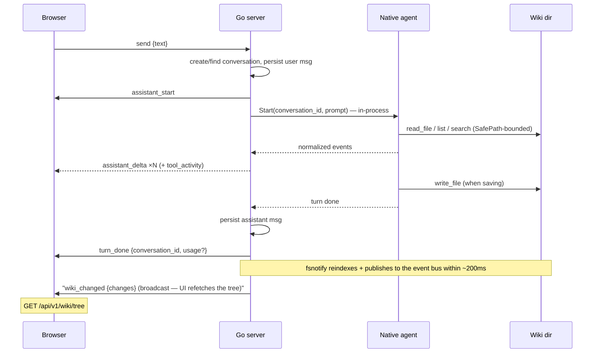

# API

The server exposes REST for everything except the live chat and server-push notifications (`wiki_changed`), which are WebSockets. All routes are registered in `internal/api/server.go`.

**Versioning:** every REST route lives under `/api/v1/...` and the chat WebSocket upgrades at `/ws/v1` (the version segment is the `APIVersion` constant in `internal/api/server.go`). The unversioned paths do not exist — a hard move, since the embedded frontend ships in the same binary. A future breaking change bumps the segment (v2, …) rather than mutating v1 in place.

> **REST reference:** the REST API is fully specified in the OpenAPI 3.x document served by a dev server at `/swagger.json` (the route only exists under `serve --dev`, excluded by `--no-api-docs`), or browse the interactive reference at `http://127.0.0.1:8334/api/docs`. The spec lives in `internal/api/docs/openapi.json` — the same file the server embeds — so it can never drift from the handlers. It is the authoritative source for paths, schemas, status codes, and the `{"error": "<msg>"}` envelope; this page covers only the WebSocket protocol, which the spec describes as an upgrade but not frame-by-frame.

**Logging:** every `/api/v1/*` request is logged at Info level with method, path, status, and duration (`internal/api/logging.go`) — the source of truth for latency investigations. Errors carry the error text; SPA assets and `/ws/v1` are not logged.

**SPA deep links:** `/chat/<conversation-id>` serves the app shell (index.html fallback in `internal/webui`), which loads and pins that conversation; unknown `/api/v1/*` paths stay JSON 404s.

## WebSocket chat (`/ws/v1`)

One socket per browser tab. The protocol is small and typed on both sides (`internal/api/chat.go` ↔ `web/src/ws/chat.tsx`, with the frame names centralized in `web/src/ws/events.tsx`). **The WS frames are unchanged from the old CLI-driven design** — the supersede/cancel semantics and resume replay are identical; only what happens server-side behind the frames changed (an in-process agent turn instead of a spawned CLI process). The one addition is an optional `usage` object on `turn_done` (token telemetry) — it is `omitempty` and ignored by older clients, so the protocol stays backward compatible.

| Direction | Frames |
|---|---|
| client → server | `{"type":"send","text":…}` · `{"type":"cancel"}` · `{"type":"resume","conversation_id":…}` · `{"type":"open","conversation_id":…}` · `{"type":"new_chat"}` · `{"type":"presence","active":bool}` |
| server → client | `assistant_start` · `assistant_thinking {text}` · `assistant_delta {text}` · `tool_activity {tool, detail}` · `turn_done {conversation_id, usage?}` · `wiki_changed {changes:[{op,path}]}` · `error {message}` |

`usage` (optional, `turn_done` only) — the turn's token breakdown: `{input_tokens, output_tokens, cache_read_tokens, cache_write_tokens}`. Providers that report none (or older servers) omit the field entirely.

**Semantics:**

- **Supersede** — a new `send` while a turn runs cancels the in-flight turn and starts the next
- **Cancel** — cancels the in-flight turn's context, aborting the provider stream; the UI receives `error {message:"cancelled"}` and nothing is persisted for that turn (the user message is already saved, the assistant reply is not)
- **Resume** — after a reconnect, the client sends `resume`; the server replays the last turn's frames (≤ 500-message ring), then continues live
- **Open** — pins the connection to an existing conversation so the next `send` continues it (conversation-history load). No replay, no other effect; an unknown id gets `error {message:"unknown conversation"}` and the connection stays unpinned
- **New chat** — unpins the connection (cancels an in-flight turn first, which emits `error {message:"cancelled"}`); the next `send` starts a fresh conversation
- **Presence** — the tab reports its visibility: `{"type":"presence","active":false}` when hidden/backgrounded, `true` when visible (Page Visibility API). The frame is accepted for protocol compatibility but ignored server-side — Thoth Agent keeps no idle processes to flush, so a hidden tab needs no server action
- **Sessions** — every conversation is a row in `conversations`; a turn runs in-process against Thoth Agent with the conversation id as the history key (`internal/agent`). The legacy `claude_session_id` column is retained but never written (see [Schema](schema.md))
- **Titles** — derived from the first message, truncated at 60 runes
- **Origins** — only localhost origins are accepted on the upgrade (see [Security](security.md))
- **Wiki changes** — the index watcher publishes each 200 ms debounce batch to the in-process event bus (`go-warehouse/events`); the server broadcasts `wiki_changed {changes:[{op,path}]}` (op: `create|write|remove|rename`, wiki-relative path; only paths the tree displays) to every connected client, which refetches `GET /api/v1/wiki/tree`. A watcher (re)start publishes an empty batch so a wiki-path change in Settings also refreshes the tree. Broadcasts are non-blocking: a client with a full write buffer misses the frame and recovers on its next reconnect/focus refetch; `wiki_changed` frames are not replayed on resume
