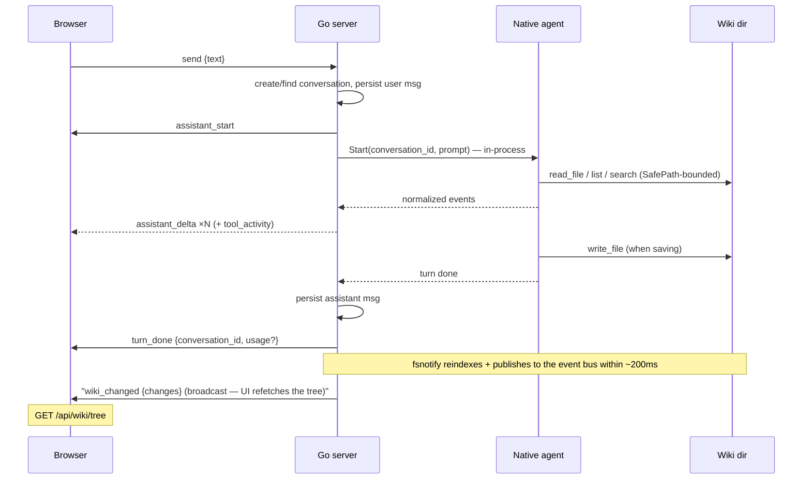

# API

The server exposes REST for everything except the live chat and server-push notifications (`wiki_changed`), which are WebSockets. All routes are registered in `internal/api/server.go`.

## REST endpoints

| Method + Path | Request | Response |
|---|---|---|
| `GET /api/health` | — | `{status, backend:{name, api_key_configured, model, provider}, wiki:{path,exists}, version, dev, commit, default_wiki_path}` — `backend` is Thoth Agent (name `thoth-agent`; `api_key_configured` is whether a key is stored, the key itself is never returned; `provider` comes from the selected model's `llm_models` row); `dev` is true under `serve --dev` (the UI shows a warning banner); `commit` is the full git commit id the dev server runs from (empty otherwise); `default_wiki_path` is the mode's wiki default in tilde form (`~/.thoth/wiki`, or `~/.thoth/dev/wiki` in dev) — the settings hint reads it |
| `GET /api/search?q=&limit=` | q required; limit default 20, clamped 1–100 | `{results:[{path,title,kind,snippet}]}` — snippet is HTML-escaped with safe `<mark>` highlights |
| `GET /api/notes?path=` | wiki-relative markdown path, or attachment (image/script/config) path | markdown: `{path, content}`; attachments: the file's raw bytes — images (`.png/.jpg/.jpeg/.gif/.svg/.webp`, per `wiki.IsImagePath`) inline with an `image/*` Content-Type, everything else as a download (`Content-Disposition: attachment` + basename). 400 when the path is missing or escapes the wiki root (via `SafePath`); 404 when the file doesn't exist. The note-vs-attachment boundary is `wiki.IsMarkdownPath`, shared with the tree and the index |
| `GET /api/wiki/tree` | — | `{nodes:[{name,path,is_dir,children,error?}]}` — a directory that exists but cannot be read (permissions, …) stays in the tree with an `error` and no children, so one locked folder never fails the whole tree; only an unreadable root 500s |
| `GET /api/fs/dirs?path=` | absolute directory path | `{dirs:[…]}` — the immediate subdirectories in lexical order, powering the Settings directory picker; 400 when the path is missing or not a readable directory |
| `GET /api/doctor` | — | `{checks:[{name, ok, message}]}` — the shared `internal/doctor` suite (same checks as `thoth doctor`) |
| `GET /api/settings` | — | `{wiki_path, wiki_folders, model, has_api_key, providers, repo_url, sync_enabled}` — every value lives in the `settings` key/value table in thoth.db (config.toml is deprecated); `wiki_folders` is the configured scaffold folder set (`[]` when unset → defaults); `providers` maps each llm_models provider label to `{has_api_key, base_url}` (api keys are never returned, only whether one is stored); the shared api key itself is never returned either |
| `PUT /api/settings` | `{wiki_path, wiki_folders, model, api_key?, providers, repo_url, sync_enabled}` | saved values (KV upserts; the wiki-path-change callback runs first); 400 when `wiki_path` is empty; an empty or omitted `api_key` leaves the stored key unchanged. `providers` is `{<label>:{api_key?, base_url}}` — `base_url` round-trips (empty clears back to the default endpoint) and `api_key` follows the same leave-unchanged rule as the shared key |
| `GET /api/models` | — | `{models:[{id, value, name, description, provider}]}` — the llm_models table (seeded from `internal/assets/models.json` on first boot, then user-editable); the chosen `value` feeds the `model` setting |
| `POST /api/models` | `{value, name, description?, provider?}` | the created model with its `id`; 400 when `value`/`name` are empty, 409 when the value is taken |
| `PUT /api/models/:id` | `{value, name, description?, provider?}` | the updated model; 400/404/409 as above. Renaming the selected model's value moves the `model` setting to it |
| `DELETE /api/models/:id` | — | `{ok:true}`; 404 when the model is missing. Deleting the selected model clears the `model` setting (next boot falls back to the first seeded claude model) |
| `POST /api/github/auth` | `{token}` | identity `{username, display_name, email, avatar_url, scopes}` — the token itself is never returned; 400 "token is required" / "github rejected the token" |
| `GET /api/github/auth` | — | identity (all fields empty when not connected) |
| `DELETE /api/github/auth` | — | `{ok:true}` (idempotent) |
| `GET /api/github/repos` | — | `{repos:[{full_name, clone_url}]}` — the connected account's repos (fetched with the stored token; empty when not connected; 400 "github rejected the token" when revoked) |
| `GET /api/conversations` | — | `{conversations:[{id,title,created_at}]}` |
| `POST /api/conversations` | `{title}` | `{id,title}` |
| `GET /api/conversations/:id` | — | `{conversation, messages:[…]}` — each message may carry an optional `usage` token breakdown `{input_tokens, output_tokens, cache_read_tokens, cache_write_tokens}` on the assistant message that ended a turn (persisted alongside the answer; absent on user messages and pre-telemetry rows) |
| `DELETE /api/conversations/:id` | — | `{ok:true}` — removes the conversation and its messages (idempotent) |
| `POST /api/git/setup` | `{url}` | `{ok:true}` or `{ok:false, error}` — runs the host's git sync on the pure-Go `agent/git` backend (no git binary): inits a repo in the wiki dir if needed, points `origin` at `url`, commits the tree (a clean tree is "nothing to commit", not an error), and pushes `HEAD`. Push authenticates with the stored GitHub token (BasicAuth) and the committer identity also comes from the `github_auth` row, so a connected account is required; a missing connection or failed step returns `ok:false` with a sanitized message that never echoes credentials or URLs |

**Errors:** JSON `{"error":"<msg>"}` — 400 for client errors, 404 not found, 500 always the generic `{"error":"internal error"}` (details go to the server log only).

**Logging:** every `/api/*` request is logged at Info level with method, path, status, and duration (`internal/api/logging.go`) — the source of truth for latency investigations. Errors carry the error text; SPA assets and `/ws` are not logged.

**SPA deep links:** `/chat/<conversation-id>` serves the app shell (index.html fallback in `internal/webui`), which loads and pins that conversation; unknown `/api/*` paths stay JSON 404s.

## WebSocket chat (`/ws`)

One socket per browser tab. The protocol is small and typed on both sides (`internal/api/chat.go` ↔ `web/src/ws/chat.ts`). **The WS frames are unchanged from the old CLI-driven design** — the supersede/cancel semantics and resume replay are identical; only what happens server-side behind the frames changed (an in-process agent turn instead of a spawned CLI process). The one addition is an optional `usage` object on `turn_done` (token telemetry) — it is `omitempty` and ignored by older clients, so the protocol stays backward compatible.

| Direction | Frames |
|---|---|
| client → server | `{"type":"send","text":…}` · `{"type":"cancel"}` · `{"type":"resume","conversation_id":…}` · `{"type":"open","conversation_id":…}` · `{"type":"new_chat"}` · `{"type":"presence","active":bool}` |
| server → client | `assistant_start` · `assistant_thinking {text}` · `assistant_delta {text}` · `tool_activity {tool, detail}` · `turn_done {conversation_id, usage?}` · `wiki_changed {changes:[{op,path}]}` · `error {message}` |

`usage` (optional, `turn_done` only) — the turn's token breakdown: `{input_tokens, output_tokens, cache_read_tokens, cache_write_tokens}`. Providers that report none (or older servers) omit the field entirely.

**Semantics:**

- **Supersede** — a new `send` while a turn runs cancels the in-flight turn and starts the next
- **Cancel** — cancels the in-flight turn's context, aborting the provider stream; the UI receives `error {message:"cancelled"}` and nothing is persisted for that turn (the user message is already saved, the assistant reply is not)
- **Resume** — after a reconnect, the client sends `resume`; the server replays the last turn's frames (≤ 500-message ring), then continues live
- **Open** — pins the connection to an existing conversation so the next `send` continues it (conversation-history load). No replay, no other effect; an unknown id gets `error {message:"unknown conversation"}` and the connection stays unpinned
- **New chat** — unpins the connection (cancels an in-flight turn first, which emits `error {message:"cancelled"}`); the next `send` starts a fresh conversation
- **Presence** — the tab reports its visibility: `{"type":"presence","active":false}` when hidden/backgrounded, `true` when visible (Page Visibility API). The frame is accepted for protocol compatibility but ignored server-side — Thoth Agent keeps no idle processes to flush, so a hidden tab needs no server action
- **Sessions** — every conversation is a row in `conversations`; a turn runs in-process against Thoth Agent with the conversation id as the history key (`internal/agent`). The legacy `claude_session_id` column is retained but never written (see [Schema](schema.md))
- **Titles** — derived from the first message, truncated at 60 runes
- **Origins** — only localhost origins are accepted on the upgrade (see [Security](security.md))
- **Wiki changes** — the index watcher publishes each 200 ms debounce batch to the in-process event bus (`go-warehouse/events`); the server broadcasts `wiki_changed {changes:[{op,path}]}` (op: `create|write|remove|rename`, wiki-relative path; only paths the tree displays) to every connected client, which refetches `GET /api/wiki/tree`. A watcher (re)start publishes an empty batch so a wiki-path change in Settings also refreshes the tree. Broadcasts are non-blocking: a client with a full write buffer misses the frame and recovers on its next reconnect/focus refetch; `wiki_changed` frames are not replayed on resume
