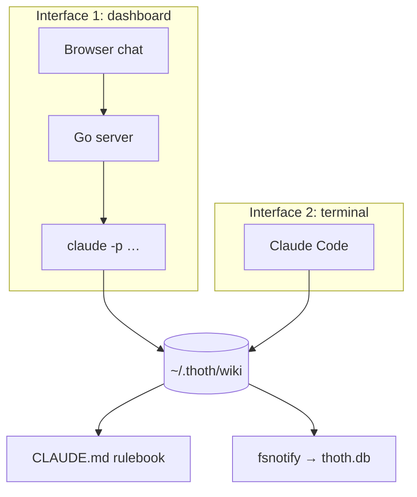

# Architecture

Thoth is built as two cleanly separated layers: a **knowledge layer** (plain markdown you own) and an **app layer** (a single Go binary that serves everything).

```mermaid
flowchart LR
    subgraph Browser
        UI[React dashboard]
    end
    subgraph Binary["thoth (single Go binary)"]
        API[Echo server — REST + WebSocket]
        CLI[Claude CLI client]
        INDEX[(SQLite — FTS5 index + conversations)]
        WATCH[fsnotify watcher]
    end
    subgraph Data["Knowledge layer"]
        WIKI[~/.thoth/wiki — markdown + CLAUDE.md]
        ST[settings table (thoth.db)]
    end
    CC[Claude Code CLI process]

    UI <-->|REST /api/*| API
    UI <-->|WS /ws| API
    API --> CLI
    CLI -->|spawns headless, cwd=wiki| CC
    CC <-->|reads / writes notes| WIKI
    WATCH -->|fs events| INDEX
    API --> INDEX
    INDEX --> ST
    CC -.->|"same directory, same rules"| WIKI
```

## The knowledge layer

Everything you know lives as markdown files in one directory (default `~/.thoth/wiki`, configurable). It has a folder structure, naming conventions, and a `CLAUDE.md` rulebook that tells Claude how to file and find things. The layer exists independently of the app — you can point Claude Code at it directly in a terminal. See [Knowledge base](knowledge-base.md).

## The app layer

One static binary (`bin/thoth`) containing:

- **Echo server** — serves the embedded React build and the API (REST + WebSocket)
- **Claude CLI client** — spawns `claude` headless per conversation, streams events, kills process groups on cancel. All CLI flags live in one file (`internal/claude/client.go`)
- **SQLite** — two roles in one db file: FTS5 search index over notes, and conversation/message history
- **fsnotify watcher** — keeps the index in sync no matter which tool edits the wiki

See [Components](components.md), [Indexing & search](indexing.md), [API](api.md).

## The data contract

**Files are the source of truth. `thoth.db` is derived data.**

- Deleting the database costs only a reindex — no knowledge is lost
- The wiki is never dependent on the app; both interfaces (the app's spawned Claude sessions, and Claude Code in a terminal) read and write the same tree under the same rules
- The index syncs with the tree at every startup and on wiki-path changes — incrementally, so unchanged files are not re-indexed

## Two interfaces, one contract



Both paths obey the same wiki rulebook, so notes are filed identically no matter who wrote them.
