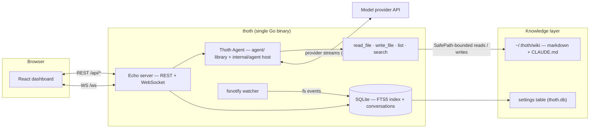
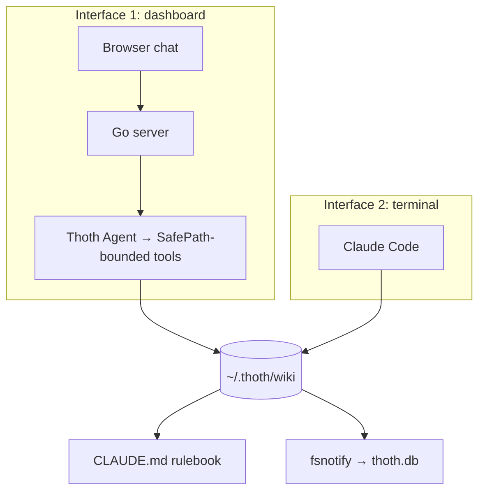

# Architecture

Thoth is built as two cleanly separated layers: a **knowledge layer** (plain markdown you own) and an **app layer** (a single Go binary that serves everything).

## The knowledge layer

Everything you know lives as markdown files in one directory (default `~/.thoth/wiki`, configurable). It has a folder structure, naming conventions, and a `CLAUDE.md` rulebook that tells Claude how to file and find things. The layer exists independently of the app — you can point Claude Code at it directly in a terminal. See [Knowledge base](knowledge-base.md).

## The app layer

One static binary (`bin/thoth`) containing:

- **Echo server** — serves the embedded React build and the API (REST + WebSocket)
- **Thoth Agent** — the built-in assistant, fully in-process, no subprocess. The reusable `agent/` library (the tool-use loop, the `Provider` seam, the tool registry) is hosted by `internal/agent`, which wires it to the wiki, store, and index and implements the chat seam the server depends on. Every turn runs one loop against the configured model provider; cancelling a turn just cancels its context
- **SQLite** — two roles in one db file: FTS5 search index over notes, and conversation/message history
- **fsnotify watcher** — keeps the index in sync no matter which tool edits the wiki

See [Components](components.md), [Indexing & search](indexing.md), [API](api.md).

### Why Thoth Agent

The assistant used to be a headless Claude Code CLI process spawned per conversation (epic #121 replaced it). Thoth Agent exists to make the chat path a pure library call:

- **No external dependency** — no `claude` binary to install, log in, put on `PATH`, or keep up to date; a CLI upgrade can no longer break the chat path
- **No process pool** — the old lifecycle (lazily spawn one process per conversation, evict idle ones, flush on wiki-path change, warm at boot) is gone; a turn is an in-process function call, so cancel is context cancellation instead of a process-group kill
- **Any provider** — the `Provider` seam means the registry can point at Anthropic or any OpenAI-compatible endpoint (DeepSeek, Qwen, GLM, Grok, …), instead of being locked to the CLI's Anthropic wire format
- **Rulebook freshness** — the system prompt is re-read from `wiki/CLAUDE.md` on every turn, so rulebook edits apply without restarting a process or the server

## The data contract

**Files are the source of truth. `thoth.db` is derived data.**

- Deleting the database costs only a reindex — no knowledge is lost
- The wiki is never dependent on the app; both interfaces (Thoth Agent, whose tool calls are bounded to the wiki, and Claude Code in a terminal) read and write the same tree under the same rules
- The index syncs with the tree at every startup and on wiki-path changes — incrementally, so unchanged files are not re-indexed

## Two interfaces, one contract

Both paths obey the same wiki rulebook, so notes are filed identically no matter who wrote them.
