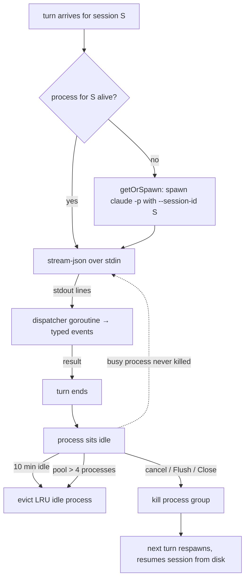

# Components

The Go backend is organized as small packages with one purpose each, communicating through narrow interfaces. Everything lives under `internal/` except the binary entrypoint.

| Package | Responsibility | Key exports |
|---|---|---|
| `cmd/thoth` | Thin `main` — calls the CLI and exits | `main` |
| `internal/cli` | Cobra commands: serve, init, version, doctor | `Execute()` |
| `internal/claude` | **The blast wall** — the only package that knows CLI flags, stream parsing, and process kill mechanics | `Client`, `CLIClient`, `PersistentClient`, `Event`, `ParseLine`, `FakeClient` |
| `internal/agent` | The native agent host — the only Thoth-aware code that talks to the reusable `agent` library; the drop-in chat `Client` seam on `agent.Agent` | `Client`, `New`, `SystemPrompt`, `History` |
| `internal/wiki` | The file contract: scaffolding, parsing, path safety, tree | `Scaffold`, `ParseNote`, `SafePath`, `Wiki`, `Rulebook` |
| `internal/index` | SQLite + FTS5 + watcher | `Index`, `Sync`, `Watch`, `Search` |
| `internal/assets` | Static data files served by the API (embedded) | `models.json` → `ModelOptions` (the llm_models seed) |
| `internal/store` | Conversations, messages, and the llm_models registry (same db file) | `Store` |
| `internal/api` | Echo server: routes, WS hub, handlers | `Deps`, `New`, `Hub` |
| `internal/config` | Localhost bind constants (`127.0.0.1:8333`) + `ExpandHome` path helper | `DefaultHost`, `DefaultPort`, `ExpandHome` |
| `internal/doctor` | Shared install checks (the `thoth doctor` CLI and the Settings → Doctor tab run the same suite) | `Check`, `Run` |
| `internal/github` | GitHub identity (PAT storage) and git sync | `Client`, `Auth`, `Repo`, `Service` |
| `internal/settings` | The settings KV table (thoth.db) — the single source for user-facing settings | `Repo`, `OpenRepo` |
| `internal/webui` | Embedded frontend | `Register` |

## internal/claude — the blast wall

Everything version-sensitive about the Claude Code CLI lives in exactly two files:

- `client.go` — the flag lists (per-turn `-p --output-format stream-json --verbose --session-id …` and persistent-mode `-p --input-format stream-json … --autocompact auto`; plus `--dangerously-skip-permissions` by default, or `--permission-mode <mode>` when configured, plus optional `--model`), spawn, stream scanning, cancel; stderr is captured and appended to exit errors. A configured `APIKey` is injected into every spawn as `ANTHROPIC_API_KEY` (appended last so it overrides any parent value); no key configured means the process inherits the server's environment untouched
- `persistent.go` — `PersistentClient`, a pool of long-lived CLI processes keyed by session id: lazily spawned, capped at 4 (`MaxProcs`; the least-recently-used idle process is evicted to make room, busy processes are never killed), one dispatcher goroutine per process turns stdout lines into events for the in-flight turn and ends it at the CLI's `result` line; cancel kills the process and the next turn respawns; idle processes evict after 10 min; `Flush` on wiki-path change or when the user leaves the chat page, `Close` on shutdown. `Warm` eagerly spawns one session's process (same `getOrSpawn`/`spawnLocked` path a turn uses, no prompt) and arms the same idle timer — serve calls it at boot for the most recently active conversation, so resuming it skips the CLI boot
- `events.go` — tolerant parsing of `stream-json` lines into typed events: `assistant_delta`, `thinking` (thinking-only assistant blocks — the UI shows "Thinking…" with the block text), `tool_activity`, `turn_done`, `error`; the raw stream is also appended to `~/.thoth/stream-dump.json` for debugging (rotated past 10MB)

```go
type Client interface {
    Start(ctx context.Context, sessionID, prompt string, w EventWriter) error
}
```

Cancelling `ctx` kills the CLI's process group (unix) or direct child (windows) — `proc_unix.go` / `proc_windows.go` are build-tagged for that; for a pooled process the kill evicts it and the next turn respawns (there is no per-turn interrupt in the plain CLI). A CLI upgrade can only ever break this package; everything else is stable.

### PersistentClient lifecycle



`FakeClient` replays scripted events and records calls — every consumer's tests use it, so no test ever touches the real CLI.

## internal/agent — the native agent host

The only Thoth-aware code that talks to the reusable `agent` library (imported as `agentlib`). `Client` implements the chat seam the Hub depends on — the same `Start(ctx, sessionID, prompt, w, opts…)` signature as `claude.Client` — by driving `agent.Agent` instead of the CLI; `sessionID` is the conversation id for history lookup.

- `New(model, apiKey, wiki, store, index, opts…)` wires everything: the provider is picked from the model id (`claude-*` → Anthropic, `gpt-*` → OpenAI-compatible; `WithProvider` overrides for tests), and the tools are built from the wiki.
- `Start` builds a fresh `agent.Agent` per turn: the system prompt is re-read from `wiki/CLAUDE.md` (the user-editable rulebook) so edits apply without restart, and the loop is single-turn while the Hub serves many conversations at once. `opts` are accepted for signature parity and ignored — the native agent has no CLI session to fork.
- `tools.go` — `wikiFS` implements the agent `tools.FS` seam, resolving every path through `wiki.SafePath` (reads/writes/lists can never escape the wiki); `search` runs over the FTS `index.Index`.
- `system.go` — `SystemPrompt(w, folders)` reads the rulebook per call, falling back to `RulebookFor(folders)` when absent.
- `history.go` — `History(store)` maps `store.Messages` (roles user/assistant) to agent messages; the trailing user message (the in-flight prompt the loop appends) is dropped, and the loop caps the rest (`HistoryCap`).

Not yet wired into `serve` — the switch-over (T9) replaces `internal/claude` in the Hub and deletes this package's CLI twin.

## internal/wiki — the file contract

- `Scaffold(dir)` — creates the 9 folders + rulebook; never overwrites an existing `CLAUDE.md`
- `Rulebook()` — the single source of the rulebook text (embedded template); the frontmatter `type:` list is derived from the folder set (`NoteTypesFor`), so it can never drift
- `ParseNote(content)` — splits frontmatter, requires `title`, returns `NoteMeta` + body
- `Validate(rel, content)` — save-protocol checks (frontmatter, `type` matches the folder, kebab-case filename, date-prefix in `meetings/`/`daily/`); advisory problems, never fatal — the index logs them and the doctor's "malformed" check surfaces parse failures by name
- `SafePath(root, rel)` — rejects absolute paths and `..` escapes; every filesystem access routes through it
- `Wiki` — `New`, `Exists`, `Read`, `Tree` (dirs first, dotfiles and the root rulebook skipped via the shared `Visible` predicate); a directory that cannot be read keeps its node with an `Error` and no children instead of failing the whole walk (only an unreadable root errors); `Change`/`Changed` + op constants are the watcher's event-bus payload

## internal/index — search and sync

- `Open(path)` — WAL mode + schema migration
- `Upsert` / `Delete` / `DeletePrefix` — with FTS5 triggers keeping the index in sync
- `Search(q, limit)` — bm25 ranking (title 8×) and body snippets, HTML-escaped
- `Sync(root, log)` — reconciles the index with the tree in one transaction (unchanged files skipped, missing files deleted); malformed notes skipped
- `Watch(ctx, root, ix, log, opts ...WatchOption)` — fsnotify with 200 ms debounce and new-directory rescan; `WithPublisher` hooks one `wiki.Changed` batch per flush (startup publishes an empty one) for event-bus consumers; errors on the watcher's `Errors` channel are logged as structured warns (a silent drop would hide a directory that is no longer being watched)

Full mechanics: [Indexing & search](indexing.md).

## internal/api — the server

`Deps` carries every dependency; `New(d Deps) *echo.Echo` wires all routes. `Hub` owns the WebSocket lifecycle: one active turn per conversation, supersede-on-send, cancel, and a 500-message replay buffer for reconnects. It also keeps a client registry and `Broadcast`s server-push frames (non-blocking; slow clients are skipped). Each client tracks its tab's visibility (`presence` frames): when no client is active — all disconnected or hidden — the hub runs `OnChatAway` after `RelaxTimeout` (serve wires it to the pool's `Flush`, so idle CLI processes die ~1 min after the user leaves the chat page). When `Deps.Events` carries the event bus (`go-warehouse/events`, built in `internal/cli/serve.go`), `newServer` subscribes and forwards every `wiki.Changed` batch to all clients as a `wiki_changed` frame. Protocol details: [API](api.md).

## internal/store

Conversations, messages, and the llm_models registry in the same `thoth.db` (separate `*sql.DB`, WAL makes sharing safe). The whole schema lives in embedded `.sql` migrations in `migrations/`, applied in filename order and gated on `PRAGMA user_version`; a single-row `app_metadata` table (enforced by `CHECK (id = 1)`) holds install facts (`installation_id`, `created_at`, seeded by `EnsureMetadata` on boot) and git sync state (`last_synced_at`, `sync_error`, written by `SetSyncResult`). IDs are valid RFC 4122 v4 UUIDs (`google/uuid`) because the Claude CLI requires UUIDs for `--session-id`. Timestamps are stored UTC so ordering is chronological.

`models.go` owns the `llm_models` CRUD (`ListModels`, `Model`, `CreateModel`, `UpdateModel`, `DeleteModel`); duplicate `value`s surface as the `ErrModelExists` sentinel (typed SQLite constraint code, not string matching), missing ids as `ErrModelNotFound`. Seeding is not a store method — `ensureModels` in `internal/cli` seeds from `assets.ModelOptions()` whenever the table is empty, so every startup self-heals an empty registry.

## internal/cli

`Execute()` builds the root Cobra command. `serve` is a thin orchestration function whose helpers (`thothDir`, `settleWikiPath`, `ensureWiki`, `openIndex`, `resolveClaudeBin`, `prewarmPool`, `ensureModels`, `onSettingsSaved`, `serveUntilShutdown`) keep each step readable. Details: [CLI](cli.md).

## internal/doctor

`Run(ctx, dir, addr, log)` runs the ten install checks (wiki, claude, claude login, api key, model, database, index, malformed, api, websocket) and returns `[]Check`, each carrying `Name`/`OK`/`Message`. The dashboard's Settings → Doctor tab runs the same suite via `GET /api/doctor` (details: [CLI](cli.md)).

## internal/github

`Client` talks to api.github.com (identity + repos; the token is never sent anywhere else), `Repo` stores the PAT and identity in the `github_auth` table, and `Service` drives the git sync (init, remote, commit, push — errors sanitized). Details: [Schema](schema.md).

## internal/settings

`Repo` (`OpenRepo(path)`) owns the `settings` KV table — `wiki_path`, `wiki_folders`, `github_sync_*` keys — with sync-state conveniences. It deliberately runs no migrations and no WAL pragma: the doctor must never mutate a database it only reads. Details: [Schema](schema.md).

## internal/gitutil

`Init(dir)` runs `git init` unless `dir` is already a repository, with a fixed timeout and a sanitized failure message. It is the single home for the command, shared by the wiki scaffold (every scaffold version-controls the wiki from day one) and `internal/api/git.go` (the Settings → Git remote setup).
