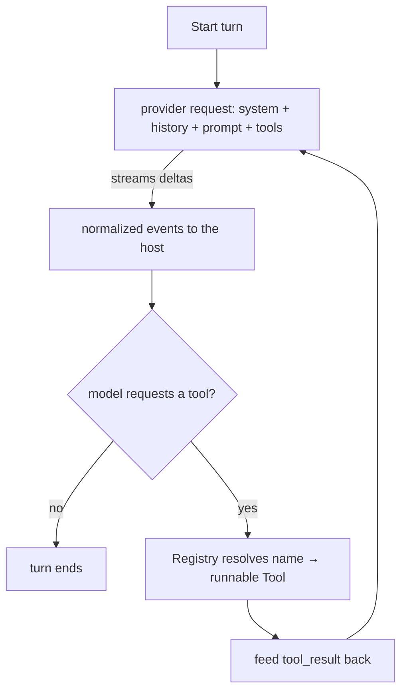

# Components

The Go backend is organized as small packages with one purpose each, communicating through narrow interfaces. Everything lives under `internal/` except the binary entrypoint.

| Package | Responsibility | Key exports |
|---|---|---|
| `cmd/thoth` | Thin `main` — calls the CLI and exits | `main` |
| `internal/cli` | Cobra commands: serve, init, version, doctor | `Execute()` |
| `agent` | The reusable native-agent library (repo-root module): provider-agnostic tool-use loop, the `Provider` wire seam, the tool registry, normalized events/model — the engine behind **Thoth Agent** | `Agent`, `New`, `Options`, `Event`, `Provider`, `Registry` |
| `internal/agent` | The Thoth host on the `agent` library — the only Thoth-aware code that talks to it; the drop-in chat `Client` seam the Hub depends on | `Client`, `New`, `SystemPrompt`, `History` |
| `internal/wiki` | The file contract: scaffolding, parsing, path safety, tree | `Scaffold`, `ParseNote`, `SafePath`, `Wiki`, `Rulebook` |
| `internal/index` | SQLite + FTS5 + watcher | `Index`, `Sync`, `Watch`, `Search` |
| `internal/assets` | Static data files served by the API (embedded) | `models.json` → `ModelOptions` (the llm_models seed) |
| `internal/store` | Conversations, messages, and the llm_models registry (same db file) | `Store` |
| `internal/api` | Echo server: routes, WS hub, handlers | `Deps`, `New`, `Hub` |
| `internal/config` | Localhost bind constants (`127.0.0.1:8333`) + `ExpandHome` path helper | `DefaultHost`, `DefaultPort`, `ExpandHome` |
| `internal/doctor` | Shared install checks (the `thoth doctor` CLI and the Settings → Doctor tab run the same suite) | `Check`, `Run` |
| `internal/github` | GitHub identity (PAT storage) and git sync | `Client`, `Auth`, `Repo`, `Service` |
| `internal/settings` | The settings KV table (thoth.db) — the single source for user-facing settings | `Repo`, `OpenRepo` |
| `internal/webui` | Embedded frontend | `Register` |

## agent/ — the reusable native agent library

The repo-root `agent` module is the provider-agnostic core of Thoth's native agent, organized so hosts and concrete providers import only what they need:

- **Root package (`agent.go`)** — `Agent`, the tool-use loop, plus re-exports of the public API. `New(Options)` fails when `Provider` or `Model` is missing. `Options` carries `Provider`, `Model`, `System`, `History` (prior messages of a conversation, capped to `HistoryCap` turns), `Tools` (the `*tools.Registry` the loop resolves `tool_use` calls through), `MaxIterations` (bounds provider turns; default 25 — a loop whose model keeps requesting tools past the cap terminates with an explicit error event instead of hanging), `MaxOutputTokens`, and `Logger`. An `Agent` is single-turn and not safe for concurrent `Start` calls — hosts build a fresh one per turn
- `events` — the normalized turn events a host forwards to its UI: `assistant_delta`, `tool_activity`, `thinking`, `turn_done`, `error`. The type names and fields are stable public API — the WS protocol and the frontend depend on them
- `model` — the normalized message/block/delta data model and the streaming `Builder` that accumulates deltas into the message the loop acts on
- `provider` — the wire-layer seam every model provider implements: `Provider.Stream(ctx, Request) (Stream, error)`. The loop knows nothing about a vendor's wire format — it sends one normalized `Request` (system, messages, tools, max tokens) and consumes normalized deltas from the returned `Stream`; `Accumulate` consumes a stream to a completed `Response` and always closes it. Concrete providers live as subpackages: `agent/provider/anthropic` and `agent/provider/openai` (OpenAI-compatible), both reading SSE through `agent/transport`
- `tools` — the `Tool` extension point (stable `Name`/`Description`/`Schema`, executed by `Run`), the `Registry` (register once at startup, then read), and the default root-bounded file/search tools: `read_file`, `write_file`, `list` over an `FS` seam, plus `search` over a host-injected `SearchFunc`. `OSFS` binds every relative path to a root and rejects escapes; hosts inject their own `FS` to add further constraints

### The tool-use loop

`FakeClient` in `internal/agent` replays scripted events and records calls — every chat consumer's tests use it, so no test ever touches a real provider.

The library replaced the spawned Claude Code CLI (epic #121): `internal/claude` — the flag lists, stream parsing, `persistent.go`'s process pool, and the build-tagged `proc_unix.go`/`proc_windows.go` kill mechanics — was deleted wholesale, so a CLI upgrade can no longer break the chat path.

## internal/agent — the Thoth Agent host

The only Thoth-aware code that talks to the reusable `agent` library (imported as `agentlib`). `Client` implements the chat seam the Hub depends on — `Start(ctx, sessionID, prompt, w)` — by driving `agent.Agent` instead of a CLI subprocess; `sessionID` is the conversation id for history lookup.

- `New(model, apiKey, wiki, store, index, opts…)` wires everything: the provider is picked from the model's provider name (`WithProviderConfig(name, baseURL)` — "Anthropic" → Anthropic, every other name → OpenAI-compatible pointed at its base URL; an empty name falls back to the model id prefixes `claude-*`/`gpt-*`; `WithProvider` overrides for tests), and the tools are built from the wiki.
- `Start` builds a fresh `agent.Agent` per turn: the system prompt is re-read from `wiki/CLAUDE.md` (the user-editable rulebook) so edits apply without restart, and the loop is single-turn while the Hub serves many conversations at once.
- `tools.go` — `wikiFS` implements the agent `tools.FS` seam, resolving every path through `wiki.SafePath` (reads/writes/lists can never escape the wiki); `search` runs over the FTS `index.Index`.
- `system.go` — `SystemPrompt(w, folders)` reads the rulebook per call, falling back to `RulebookFor(folders)` when absent.
- `history.go` — `History(store)` maps `store.Messages` (roles user/assistant) to agent messages; the trailing user message (the in-flight prompt the loop appends) is dropped, and the loop caps the rest (`HistoryCap`).

Wired into `serve` at boot — the Hub's `Client` is this host, so the whole chat path is in-process.

## internal/wiki — the file contract

- `Scaffold(dir)` — creates the 9 folders + rulebook; never overwrites an existing `CLAUDE.md`
- `Rulebook()` — the single source of the rulebook text (embedded template); the frontmatter `type:` list is derived from the folder set (`NoteTypesFor`), so it can never drift
- `ParseNote(content)` — splits frontmatter, requires `title`, returns `NoteMeta` + body
- `Validate(rel, content)` — save-protocol checks (frontmatter, `type` matches the folder, kebab-case filename, date-prefix in `meetings/`/`daily/`); advisory problems, never fatal — the index logs them and the doctor's "malformed" check surfaces parse failures by name
- `SafePath(root, rel)` — rejects absolute paths and `..` escapes, then resolves symlinks (deepest existing ancestor) and rejects any real target outside root; every filesystem access routes through it
- `Wiki` — `New`, `Exists`, `Read`, `Tree` (dirs first, dotfiles and the root rulebook skipped via the shared `Visible` predicate); the root is guarded (`Root()`/`SetRoot`) so the settings wiki-path change can swap it while turns read; a directory that cannot be read keeps its node with an `Error` and no children instead of failing the whole walk (only an unreadable root errors); `Change`/`Changed` + op constants are the watcher's event-bus payload

## internal/index — search and sync

- `Open(path)` — WAL mode + schema migration
- `Upsert` / `Delete` / `DeletePrefix` — with FTS5 triggers keeping the index in sync
- `Search(q, limit)` — bm25 ranking (title 8×) and body snippets, HTML-escaped
- `Sync(root, log)` — reconciles the index with the tree in one transaction (unchanged files skipped, missing files deleted); malformed notes skipped
- `Watch(ctx, root, ix, log, opts ...WatchOption)` — fsnotify with 200 ms debounce and new-directory rescan; `WithPublisher` hooks one `wiki.Changed` batch per flush (startup publishes an empty one) for event-bus consumers; errors on the watcher's `Errors` channel are logged as structured warns (a silent drop would hide a directory that is no longer being watched)

Full mechanics: [Indexing & search](indexing.md).

## internal/api — the server

`Deps` carries every dependency; `New(d Deps) *echo.Echo` wires all routes. `Hub` owns the WebSocket lifecycle: one active turn per conversation, supersede-on-send, cancel, and a 500-message replay buffer for reconnects. It also keeps a client registry and `Broadcast`s server-push frames (non-blocking; slow clients are skipped). Clients still send `presence` frames for their tab's visibility, but Thoth Agent keeps no idle processes to flush, so they are accepted for protocol compatibility and ignored server-side. When `Deps.Events` carries the event bus (`go-warehouse/events`, built in `internal/cli/serve.go`), `newServer` subscribes and forwards every `wiki.Changed` batch to all clients as a `wiki_changed` frame. Protocol details: [API](api.md).

## internal/store

Conversations, messages, and the llm_models registry in the same `thoth.db` (separate `*sql.DB`, WAL makes sharing safe). The whole schema lives in embedded `.sql` migrations in `migrations/`, applied in filename order and gated on `PRAGMA user_version`; a single-row `app_metadata` table (enforced by `CHECK (id = 1)`) holds install facts (`installation_id`, `created_at`, seeded by `EnsureMetadata` on boot) and git sync state (`last_synced_at`, `sync_error`, written by `SetSyncResult`). IDs are valid RFC 4122 v4 UUIDs (`google/uuid`); the conversation id is the chat history key passed to the agent as `sessionID`. Timestamps are stored UTC so ordering is chronological.

`models.go` owns the `llm_models` CRUD (`ListModels`, `Model`, `CreateModel`, `UpdateModel`, `DeleteModel`); duplicate `value`s surface as the `ErrModelExists` sentinel (typed SQLite constraint code, not string matching), missing ids as `ErrModelNotFound`. Seeding is not a store method — `ensureModels` in `internal/cli` seeds from `assets.ModelOptions()` whenever the table is empty, so every startup self-heals an empty registry.

## internal/cli

`Execute()` builds the root Cobra command. `serve` is a thin orchestration function whose helpers (`thothDir`, `settleWikiPath`, `ensureWiki`, `openIndex`, `defaultModel`, `modelProvider`, `ensureModels`, `onSettingsSaved`, `serveUntilShutdown`) keep each step readable. Details: [CLI](cli.md).

## internal/doctor

`Run(ctx, Options{Dir, Addr, Log, HTTP, BaseURL})` runs the nine install checks (wiki, provider, api key, model, database, index, malformed, api, websocket) and returns `[]Check`, each carrying `Name`/`OK`/`Message`. The provider check probes the selected model's provider models endpoint with the resolved credential — the model's `llm_models` row names the provider, whose per-provider api key/base URL win over the shared key and provider default, the same resolution `serve` uses at boot (`modelProvider`/`providerConfig`/`providerProbeFor`). The HTTP client and base URL are injectable for tests. The dashboard's Settings → Doctor tab runs the same suite via `GET /api/doctor` (details: [CLI](cli.md)).

## internal/github

`Client` talks to api.github.com (identity + repos; the token is never sent anywhere else), `Repo` stores the PAT and identity in the `github_auth` table, and `Service` drives the git sync (init, remote, commit, push — errors sanitized). Details: [Schema](schema.md).

## internal/settings

`Repo` (`OpenRepo(path)`) owns the `settings` KV table — `wiki_path`, `wiki_folders`, `github_sync_*` keys and the per-provider `provider_<slug>_api_key`/`provider_<slug>_base_url` keys (helpers `ProviderAPIKeyKey`/`ProviderBaseURLKey`) — with sync-state conveniences and `ProviderConfig(provider)`, the model→provider→credential resolution `serve` uses at boot. It deliberately runs no migrations and no WAL pragma: the doctor must never mutate a database it only reads. Details: [Schema](schema.md).

## internal/gitutil

`Init(dir)` runs `git init` unless `dir` is already a repository, with a fixed timeout and a sanitized failure message. It is the single home for the command, shared by the wiki scaffold (every scaffold version-controls the wiki from day one) and `internal/api/git.go` (the Settings → Git remote setup).
