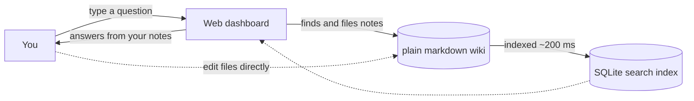

# Thoth

Thoth is a **local-first personal knowledge base**. You keep everything you know as plain markdown in one wiki directory; the built-in assistant — **Thoth Agent** — answers questions from that wiki and saves new knowledge into it, through a polished web dashboard.

One binary. One directory (`~/.thoth`). No cloud, no account, no data leaving your machine.



## What makes Thoth different

- **Files are the source of truth.** Your knowledge is plain markdown in a directory you own — readable, diffable, portable. The database is derived data you can delete at any time.
- **Ask, don't search.** Chat with your wiki in natural language, grounded in what's actually written there.
- **Organized by default.** Meeting notes, projects, links, setups, and TODOs each have a home. A rulebook keeps everything filed consistently.
- **Two interfaces, one contract.** The dashboard and a terminal both drive the same wiki under the same rules.
- **Local and private.** SQLite full-text search, localhost-only server, nothing leaves your machine.

## Getting started

1. Add a model provider API key in Settings (Anthropic, OpenAI, DeepSeek, …) — **Thoth Agent** calls the provider directly, nothing else needs installing
2. `thoth serve` — starts on http://127.0.0.1:8333 and scaffolds the default wiki at `~/.thoth/wiki` for you
3. `thoth doctor` — verify your setup anytime

`thoth init` is optional — it only changes *where* the wiki lives (`thoth init ~/notes`).

Follow the full walkthrough in [Getting started](getting-started.md), or jump into [Using Thoth](using-thoth.md) for the dashboard tour and best practices.

## Documentation map

| Page | What it covers |
|---|---|
| [What's new](whats-new.md) | Recent changes, newest first |
| [Getting started](getting-started.md) | Install, first run, first conversation |
| [Using Thoth](using-thoth.md) | Dashboard tour, chat, search, settings, GitHub sync, best practices |
| [Migrating to Thoth Agent](thoth-agent.md) | Why the built-in assistant replaced the Claude Code CLI, and what changed |
| [Architecture](architecture.md) | System design, the two layers, data contract, diagrams |
| [Knowledge base](knowledge-base.md) | The wiki directory: layout, conventions, the rulebook |
| [Schema](schema.md) | Every thoth.db table, column, and settings key |
| [Components](components.md) | Deep dive into every Go package |
| [CLI](cli.md) | `serve`, `init`, `version`, `doctor` — flags and behavior |
| [API](api.md) | REST endpoints and the WebSocket chat protocol |
| [Indexing & search](indexing.md) | SQLite schema, FTS5, the file watcher |
| [Frontend](frontend.md) | React structure, design system, hooks, state flow |
| [Security](security.md) | Threat model and the mechanisms that implement it |
| [Development](development.md) | Toolchain, commands, testing gates, CI, contribution rules |
| [Troubleshooting](troubleshooting.md) | Common problems and fixes, FAQ |

## Where things live

| Path | Role |
|---|---|
| `~/.thoth/wiki/` | The knowledge base — plain markdown you own (the source of truth) |
| `~/.thoth/thoth.db` | SQLite: search index + conversation history (derived data) |
| `thoth.db` `settings` table | Settings: `wiki_path`, `github_sync_*` keys |
| `CLAUDE.md` (wiki root) | Rules the assistant follows when reading/writing your notes |
| `code-rules` skill (`.claude/skills/code-rules/`) | Rules for working on this codebase · `CLAUDE.md` / `AGENTS.md` (repo root) are identical copies of the repo map |
| `.claude/skills/` | Procedure skills: go (backend), react (frontend), git-workflow, code-quality |
| `docs-site/` | The Docusaurus site that renders these docs |

## This documentation site

The site is built with Docusaurus from these very files — `docs/` is the single source of truth and `docs-site/` renders it. To run the site locally:

```sh
make docs-dev      # Docusaurus dev server with hot reload
make docs-build    # production build
```
