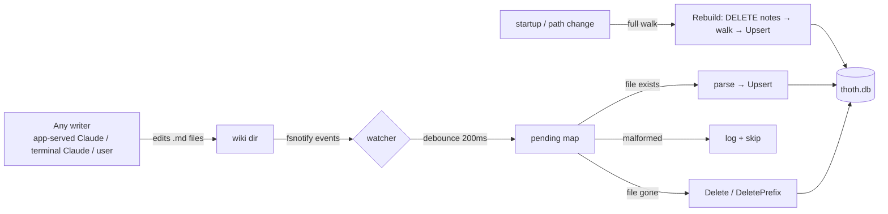

# Indexing & search

The search index is derived data: it can always be rebuilt by walking the wiki. It lives in `~/.thoth/thoth.db` alongside conversation history.

## Schema

```sql
CREATE TABLE notes (
  path TEXT PRIMARY KEY, title TEXT NOT NULL,
  kind TEXT NOT NULL DEFAULT 'note', tags TEXT NOT NULL DEFAULT '',
  body TEXT NOT NULL, updated_at TEXT NOT NULL
);

CREATE VIRTUAL TABLE notes_fts USING fts5(
  path UNINDEXED, title, body, content='notes', content_rowid='rowid'
);
```

Three triggers keep FTS in sync with `notes` on insert, delete, and update — the index and the table can never drift, no matter what code writes.

The database runs in **WAL mode**; only the Go process writes it.

## Search

`Index.Search` (`internal/index/index.go`):

- Match: FTS5 over title + body; the API wraps user queries as literal phrases (quotes stripped), so `*`, `OR`, `NOT` etc. are searched literally
- Ranking: `bm25` with the title weighted 8× the body
- Snippets: from the body, with `\x01`/`\x02` control markers → HTML-escaped → safe `<mark>`/`</mark>` tags

## Keeping the index current



- **Watcher** (`internal/index/watcher.go`) — watches every directory; Write/Create/Remove/Rename coalesce into a 200 ms debounce flush. New directories are added to the watch with an immediate rescan, so files written before registration are still indexed. Removing a directory deletes the whole subtree from the index.
- **Rebuild** (`internal/index/rebuild.go`) — clears the table and re-walks the tree at startup and on wiki-path changes. Notes with unparsable frontmatter are skipped and logged, never fatal.

## Guarantees

| Scenario | Outcome |
|---|---|
| Note saved by Claude in the app | Indexed within ~200 ms |
| Note edited in a terminal (Claude Code, vim) | Indexed within ~200 ms |
| Note deleted | Removed from index (file or whole directory) |
| Wiki path changed in Settings | New path scaffolded if needed, index rebuilt, watcher restarted |
| App restarted | Full rebuild at startup — index always reflects the tree |
| `thoth.db` deleted | No data loss — rebuilt on next serve |
