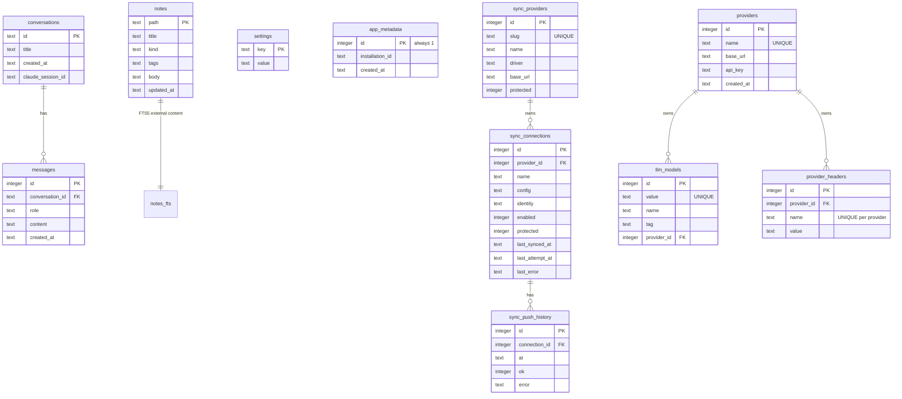

# Database schema

Everything lives in one SQLite file, `~/.thoth/thoth.db` (WAL mode). The schema is defined entirely by SQL migrations in `internal/store/migrations/` — one file per table, applied in filename order, gated on `PRAGMA user_version` (currently 15). Go code issues no DDL of its own.

## Tables

### `conversations` (migration `0001_conversations.sql`)

One row per chat shown in the UI history.

| Column | Type | Meaning |
|---|---|---|
| `id` | TEXT PK | Conversation id (v4 UUID) — also the `/chat/<id>` URL id |
| `title` | TEXT NOT NULL | First user message, truncated (display only) |
| `created_at` | TEXT NOT NULL | UTC RFC3339 — the list orders by it lexically DESC, with `rowid DESC` breaking same-second ties so "most recent" is deterministic |
| `claude_session_id` | TEXT NOT NULL DEFAULT '' | Legacy Claude CLI session id. Thoth Agent no longer spawns the CLI and nothing reads or writes the column; it is **retained for schema stability** — the decision was to leave it rather than migrate it out (see below) |

### `messages` (migrations `0002_messages.sql` + `0010_message_usage.sql`)

The chat transcript, persisted for the UI history view.

| Column | Type | Meaning |
|---|---|---|
| `id` | INTEGER PK AUTOINCREMENT | Replayed in id order |
| `conversation_id` | TEXT NOT NULL | → `conversations.id` |
| `role` | TEXT NOT NULL | `user` or `assistant` |
| `content` | TEXT NOT NULL | Plain markdown text |
| `created_at` | TEXT NOT NULL | UTC RFC3339 |
| `usage` | TEXT NULL | The assistant turn's token breakdown as JSON: `{"input_tokens":N,"output_tokens":N,"cache_read_tokens":N,"cache_write_tokens":N}`; NULL on user messages and rows written before usage was tracked |

### `notes` (migration `0003_notes.sql`)

The search index's source rows. The wiki markdown files are the source of truth — this table is derived data, rebuilt from the tree.

| Column | Type | Meaning |
|---|---|---|
| `path` | TEXT PK | Wiki-relative file path |
| `title` | TEXT NOT NULL | From frontmatter (required by the rulebook); the filename for attachments |
| `kind` | TEXT NOT NULL DEFAULT 'note' | `note`, `meeting`, `todo`, `file` (attachment), …; from the frontmatter `type:` key (`kind:` is an accepted alias) |
| `tags` | TEXT NOT NULL DEFAULT '' | Comma-joined frontmatter tags |
| `body` | TEXT NOT NULL | Note text below the frontmatter; empty for attachments |
| `updated_at` | TEXT NOT NULL | UTC RFC3339Nano (sub-second), from file mtime |

### `notes_fts` (migration `0004_notes_fts.sql`)

FTS5 full-text index over notes, kept in sync by triggers. External-content index (`content='notes'`): no data duplication; searches always JOIN back to `notes`. `path` is UNINDEXED — matches run over title+body.

### `app_metadata` (migration `0005_app_metadata.sql`)

One-time install facts, single row (enforced by `CHECK (id = 1)`).

| Column | Type | Meaning |
|---|---|---|
| `id` | INTEGER PK DEFAULT 1 | Always 1 — the single-row constraint |
| `installation_id` | TEXT NOT NULL | v4 UUID identifying this installation |
| `created_at` | TEXT NOT NULL | First boot, UTC RFC3339 |

### `settings` (migration `0007_settings.sql`)

The app's user-facing settings, key/value. `config.toml` is deprecated — this table is the single source. New keys need no schema change. Sync state (target, enabled, last sync, errors) lives on `sync_connections` rows since migration `0012` — the `github_sync_*` keys are gone.

| Key | Seed | Meaning |
|---|---|---|
| `wiki_path` | `~/.thoth/wiki` | Where the wiki lives (seed mirrors `settings.DefaultWikiPath`) |
| `wiki_folders` | — (absent) | Comma-separated scaffold folder set; absent/empty means the default 9 (`inbox, meetings, projects, links, setup, knowledge, todos, daily, attachments`). Applied when a wiki is scaffolded |
| `model` | — (absent) | The model value selected for every turn; absent/empty falls back to the first seeded claude model. Read at boot, applied on next start |
| `api_key` | `''` | Legacy shared key, seeded by migration `0008` but no longer used — credentials are per-provider (in the `providers` table since migration `0011`), and nothing is read from the environment |
| `provider_<slug>_api_key` | — (absent) | Retired. Migration `0011` moved per-provider credentials into the `providers` table; the one-time backfill in `store.Open` copies these keys into the new rows and deletes them. `slug` is the lowercased provider label with non-alphanumerics stripped (`DeepSeek` → `deepseek`, `Z.AI` → `zai`) |
| `provider_<slug>_base_url` | — (absent) | Retired, same cutover as the api key above |
| `sync_active_connection` | — (absent) | The connection id the agent's git tools and the Settings tab default to (a `sync_connections` row); absent means no active connection |
| `context_injection` | — (absent) | Opt-in pre-search of the wiki into each chat turn's first prompt (`'true'`/`'false'`; absent/other = off). Answers start faster and skip the search/read tool round-trips, but change answer semantics, so they must opt in |

### `sync_providers` (migration `0012_sync_providers.sql`)

The catalog of sync destination types. Built-ins (`github`, `gitlab`, `aws_s3`, `local`) are seeded in the migration and again at serve time from `assets/sync-providers.json` when the table is empty (the `ensureModels` self-heal pattern); users add their own rows (custom GitHub/GitLab base URLs, S3-compatible endpoints).

| Column | Type | Meaning |
|---|---|---|
| `id` | INTEGER PK AUTOINCREMENT | |
| `slug` | TEXT NOT NULL UNIQUE | Stable machine id (`github`, `local`) |
| `name` | TEXT NOT NULL | Display label (`GitHub`, `Local backup`) |
| `driver` | TEXT NOT NULL | The sync implementation: `github` \| `gitlab` \| `s3` \| `local` |
| `base_url` | TEXT NOT NULL DEFAULT '' | API endpoint override for git/s3 drivers; '' = provider default (meaningless for local) |
| `protected` | INTEGER NOT NULL DEFAULT 0 | First-class providers the user can neither delete nor edit — currently only `local` |
| `created_at` | TEXT NOT NULL | UTC RFC3339 |

### `sync_connections` (migration `0012_sync_providers.sql`)

One row per configured sync destination — the credentials + target + sync state. Supersedes the single-row `github_auth` table (dropped by `0012`).

| Column | Type | Meaning |
|---|---|---|
| `id` | INTEGER PK AUTOINCREMENT | |
| `provider_id` | INTEGER NOT NULL | → `sync_providers.id` (FK off today; the app blocks deleting a provider with connections) |
| `name` | TEXT NOT NULL | User label (`home wiki`, `work`) |
| `config` | TEXT NOT NULL DEFAULT '{}' | JSON of credentials + target (`token`/`repo_url`, `access_key_id`/`secret_access_key`/`region`/`bucket`/`prefix`/`snapshot`/`retention`, `path`, `interval`…). Local plaintext — the documented localhost trust model; **write-only over the wire** |
| `identity` | TEXT | Token-free identity JSON for display (git: username/email/…; s3: account; local: none) |
| `enabled` | INTEGER NOT NULL DEFAULT 1 | Per-connection sync switch |
| `protected` | INTEGER NOT NULL DEFAULT 0 | First-class connection (the auto-created local backup) that cannot be deleted — only its config edited |
| `last_synced_at` | TEXT | UTC RFC3339 of the last successful sync |
| `last_attempt_at` | TEXT | UTC RFC3339 of the last sync attempt (success or failure); added by `0014`. The auto-sync scheduler schedules off this so a failing connection cools down between retries instead of re-firing every tick |
| `last_error` | TEXT | Sanitized error of the last failed sync |
| `created_at` / `updated_at` | TEXT NOT NULL | UTC RFC3339 |

### `sync_push_history` (migration `0013_sync_push_history.sql`)

A bounded per-connection record of every completed push attempt, newest first. The single `last_synced_at`/`last_error` columns carry only the latest outcome; this table keeps the recent run history the Settings page renders. `AppendPushHistory` (called by `SetConnectionSyncResult`) prunes to 20 rows per connection.

| Column | Type | Meaning |
|---|---|---|
| `id` | INTEGER PK AUTOINCREMENT | Ordered newest-first for the list query |
| `connection_id` | INTEGER NOT NULL | → `sync_connections.id` |
| `at` | TEXT NOT NULL | UTC RFC3339 of the attempt |
| `ok` | INTEGER NOT NULL | 1 = pushed, 0 = failed |
| `error` | TEXT | Sanitized error for a failure; '' otherwise |
| `created_at` | TEXT NOT NULL | UTC RFC3339 |

### `providers` (migration `0011_providers.sql`)

The model providers, one row per provider the user configures. Providers are first-class: a provider row exists before any of its models, and it owns its own credentials. Rows are added/edited/deleted from the Settings → Providers tab.

| Column | Type | Meaning |
|---|---|---|
| `id` | INTEGER PK AUTOINCREMENT | Referenced by `llm_models.provider_id` |
| `name` | TEXT NOT NULL UNIQUE | Display label (e.g. `Anthropic`); the settings resolver matches on it |
| `base_url` | TEXT NOT NULL DEFAULT '' | API base URL override; empty = the provider's default endpoint |
| `api_key` | TEXT NOT NULL DEFAULT '' | The provider's own API key, stored plaintext locally. Write-only in the UI — the API reports `has_api_key` and never returns the key |
| `created_at` | TEXT NOT NULL | UTC RFC3339 |

The table is seeded from the distinct `llm_models` labels by migration `0011` (credentials copied from the legacy `provider_<slug>_*` settings keys by a one-time backfill in `store.Open`), and `ensureModels` creates any missing provider row for a model option on boot.

### `provider_headers` (migration `0015_provider_headers.sql`)

The per-provider custom request headers — e.g. gateway routing headers for Portkey (`x-portkey-provider`, `x-portkey-api-key`, `x-portkey-virtual-key`, …). One row per header so a provider can carry many and the UI edits them individually; a provider with no rows sends no extra headers. The wire providers send every row on each request, on top of the provider's own auth headers.

| Column | Type | Meaning |
|---|---|---|
| `id` | INTEGER PK AUTOINCREMENT | |
| `provider_id` | INTEGER NOT NULL | → `providers.id`; deleted with the provider (`DeleteProvider` removes them explicitly — the FK pragma is off) |
| `name` | TEXT NOT NULL | Header name (e.g. `x-portkey-provider`) |
| `value` | TEXT NOT NULL | Header value (e.g. `anthropic`) |

`UNIQUE(provider_id, name)` — saving the same header name replaces its value. The API replaces the whole set on every provider create/update (`SetProviderHeaders`), so a PUT without `custom_headers` clears them.

### `llm_models` (migrations `0008_llm_models.sql` + `0009_llm_models_tag.sql` + `0011_providers.sql`)

The user-editable model registry. Every startup seeds it from `internal/assets/llm-providers.json` (the single source for the built-in list) when the table is empty; afterwards the table is authoritative — rows are added/edited/deleted from the Settings → Providers tab.

| Column | Meaning |
|---|---|
| `id` | `INTEGER PRIMARY KEY AUTOINCREMENT` |
| `value` | The model id sent to the provider on every turn; `UNIQUE` — the `model` setting points at it |
| `name` | Display name (e.g. `Claude Opus 4.8`) |
| `tag` | Preset-friendly label rendered as a colored chip (e.g. `strongest`) |
| `provider_id` | → `providers.id`; NULL for the Unassigned catch-all. Added by `0011`, which backfilled it from the old `provider` text label and dropped that column (credential state moved to the `providers` row) |

## Reading and writing

- `internal/settings` owns the `settings` table (KV access and `ProviderConfig` for the model→provider→credential resolution, which reads the `providers` table). Its `OpenRepo` deliberately runs no migrations and no WAL pragma — the doctor must never mutate a database it only reads.
- `internal/store` owns conversations/messages/app_metadata, the `providers` table, `llm_models`, and the sync tables (`sync_providers`, `sync_connections`, `sync_push_history`); `internal/index` owns notes/notes_fts.
- **`claude_session_id` decision (T12):** the column is retained, no migration. Thoth Agent stopped writing it when it replaced the CLI; dropping it would rewrite `conversations` for a column nothing reads, and keeping it preserves the schema for any rollback tooling. The settings resolution at boot is: the selected model's `llm_models` row names its `providers` row, whose `api_key`/`base_url` are used (`settings.ProviderConfig`); empty provider → no key and the provider's default endpoint.

## Upgrade note

The schema baseline changed with the per-table restructure (config.toml deprecation) — upgrading an existing install requires deleting `thoth.db` (it is derived data; the wiki files are the source of truth).
